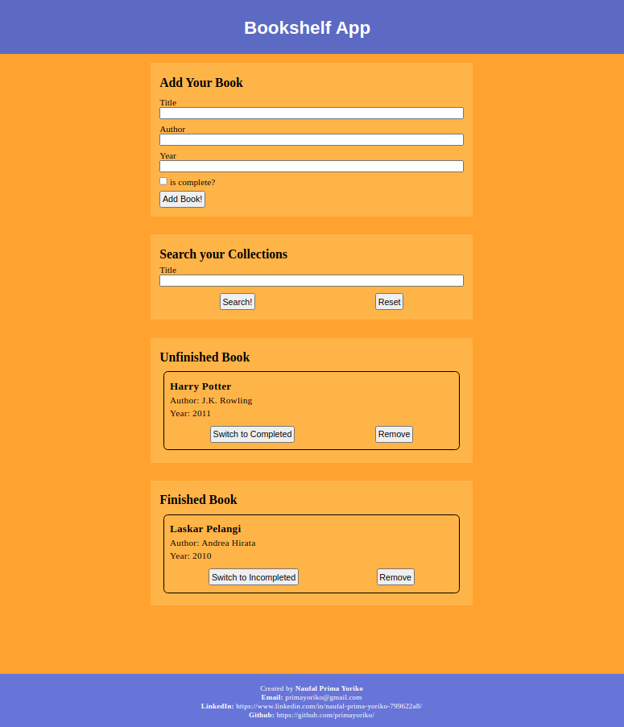
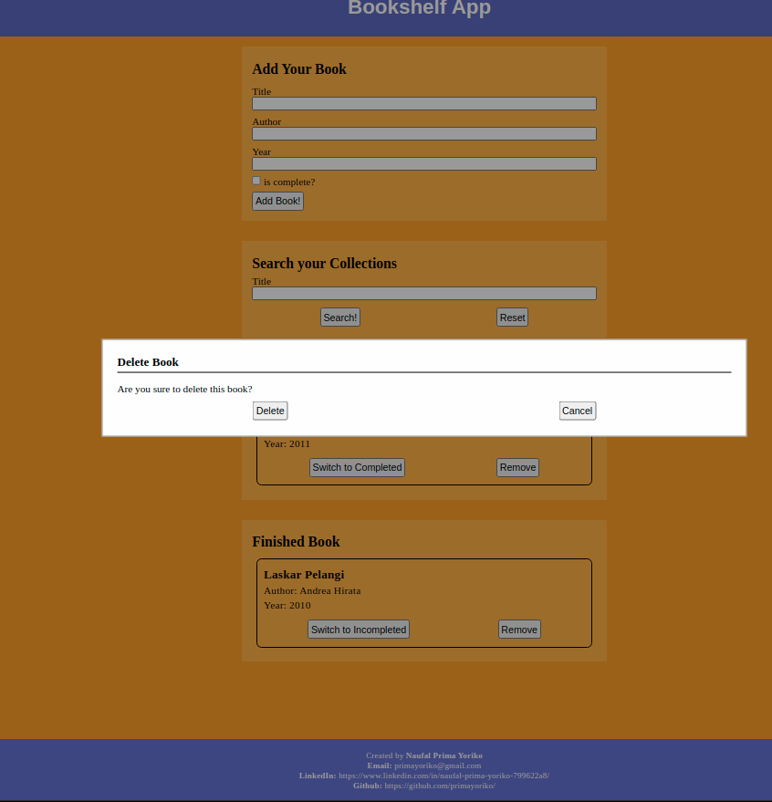
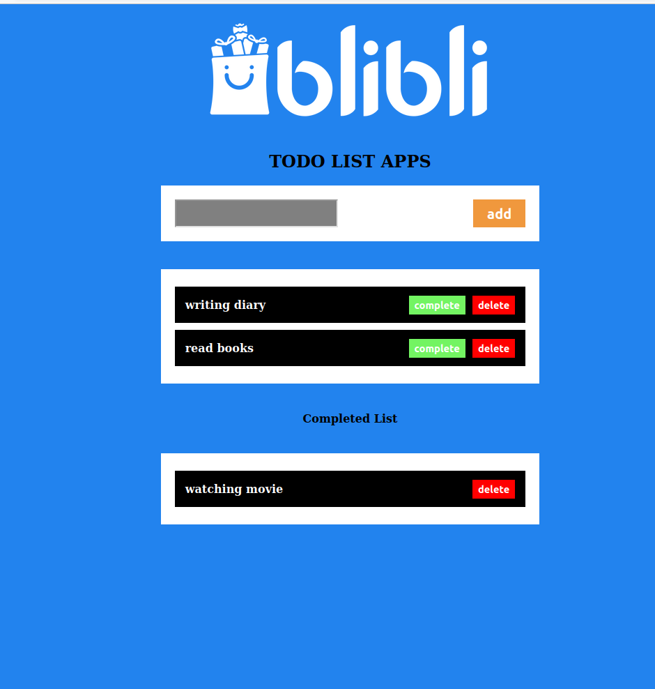

# Scratch Web Collection

---------
My works collection on web development with vanilla (no framework).

## Web List

---------

1. **BookShelf App**
   Make your own bookshelf that contain various information of your book collection. Support persistent book data with Local Storage. Created using vanilla HTML, CSS, and JavaScript.

   

   

   See it on `bookshelf-app/index.html`.

2. **Biodata Page**
   My own biodata page, created using vanilla HTML, CSS, and JavaScript.

   

   See it on `biodata-page/index.html`.

3. **Portfolio Page**
   My own portofolio page, created using vanilla HTML, JavaScript, and Bootstrap CSS. 

   

   See it on `portfolio-page/index.html`. As alternative you could see, `portfolio-page/index2.html` or `portfolio-page/dev.html`.

4. **To Do List App**
   Make your own web-based to-do list. Created using vanilla HTML, CSS, and JavaScript.

   

   See it on `todo-list-app/index.html`.
